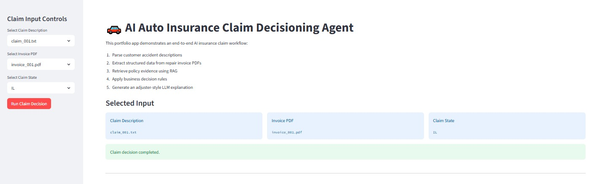
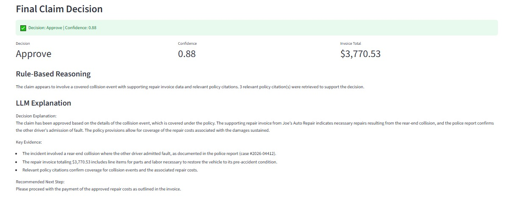
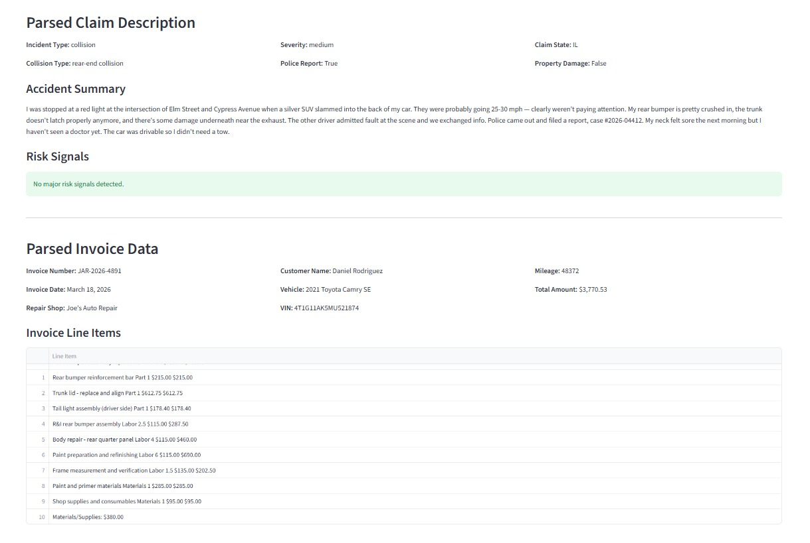
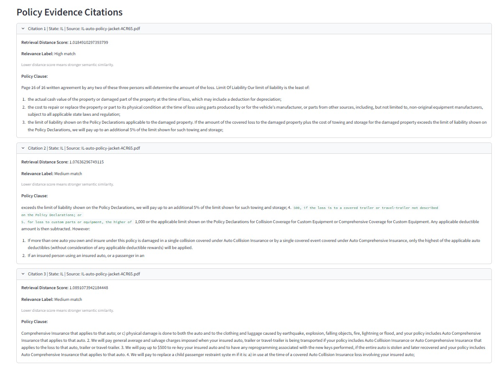

# AI Auto Insurance Claim Decisioning Agent

This is an end-to-end AI portfolio project for auto insurance claim decisioning.

## What this project does

The system takes:

- Customer accident description
- Repair invoice PDF
- Auto insurance policy documents
- Claim state

Then it:

- Parses claim descriptions
- Extracts invoice details from PDFs
- Retrieves policy evidence using RAG
- Applies claim decision rules
- Generates an AI explanation using OpenAI
- Shows results in FastAPI and Streamlit

## Tech Stack

- Python
- OpenAI API
- LangChain
- ChromaDB
- FastAPI
- Streamlit
- Pydantic
- pdfplumber
- pypdf

## Main Features

- Invoice PDF parsing
- Claim description parsing
- Policy document chunking
- Vector database search
- State-specific policy retrieval
- Rule-based decision engine
- LLM explanation generator
- FastAPI backend
- Streamlit UI

## How to Run

### 1. Activate virtual environment

```powershell
.venv\Scripts\activate


## Application Screenshots

### Streamlit UI - Claim Decision



### Final Claim Decision Output



### Parsed Claim and Invoice Data



### Policy Evidence Citations




